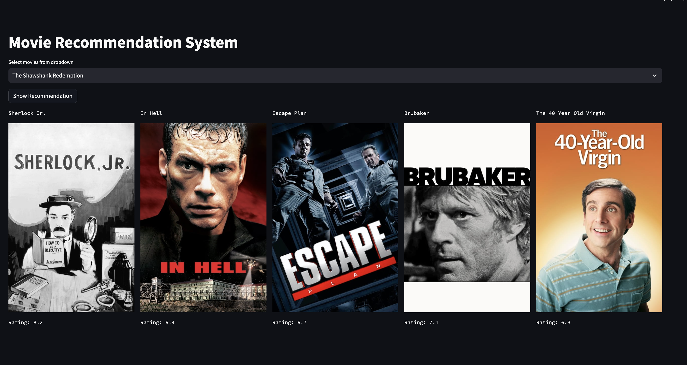

# Recommendation System (Content-Based Filtering)



Using the dataset from [TMDB Movies Dataset](https://www.kaggle.com/datasets/ahsanaseer/top-rated-tmdb-movies-10k?fbclid=IwAR2MpWrWpcw2QNCv_FZg2l0sjBh9xAvhrqtnZBO9K-QS6PHI1aHkdB6qLa0), I will try to build a recommender system for movie selection.

This project is just a personal sample project to get the knowledge of building simple recommendation system.

For this project, I will try to use the CONTENT-BASED RECOMMENDATION SYSTEM approach.

## Introduction:

Content-based filtering recommends items similar to those a user has liked or interacted with in the past, based on the characteristics of the items themselves. (e.g., tags, genre, actors, directors, description).

Approach:

- It relies on analyzing the features of items (content) and creating user profiles based on their preferences. Recommendations are made by matching the content features of items with the user profile.

Example:

- In a movie recommendation system, if a user has liked action movies in the past, the system will recommend other action movies with similar attributes (e.g., tags, genre, actors, directors, description).

Strengths:

- Doesn't require historical data from other users.
- Can provide recommendations for new or unpopular items.
- Can provide explanations for recommendations based on item features.

Weaknesses:

- Limited to recommending items similar to those the user has interacted with before.
- May suffer from the "filter bubble" problem, where recommendations are overly similar to the user's existing preferences.
- Requires a good understanding of item features and user preferences, which can be challenging to obtain.

## Technologies Used/Methodology:

- Combine movie_title and genre as one features.
- Convert text to vector using TFIDF method.
- Using Cosine Similarity to calculate the similarity score given movie_title.
- Filter top 5 score of similar movies.
- Implement on Streamlit for testing.

## How to Run:

1. Run all the [research jupyter notebook](https://github.com/fitrijamsari/movie-content-based-recommender-system/tree/main/research) code to generate pickle files of:

- movie_list.pkl
- similarities.pkl

Both files will be stored in "model" folder. similarities.pkl files will be produced with estimated of 700MB+ size.

2. Run the application on streamlit:

```bash
streamlit run app.py
```

3. Use the dropdown to select any movies. 5 list of recommended movies will be appear after selection.
